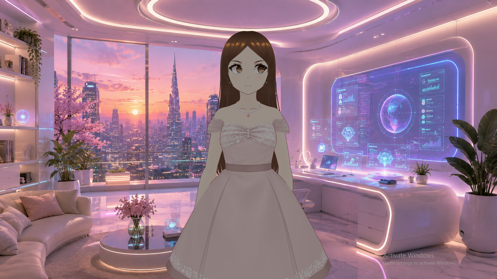
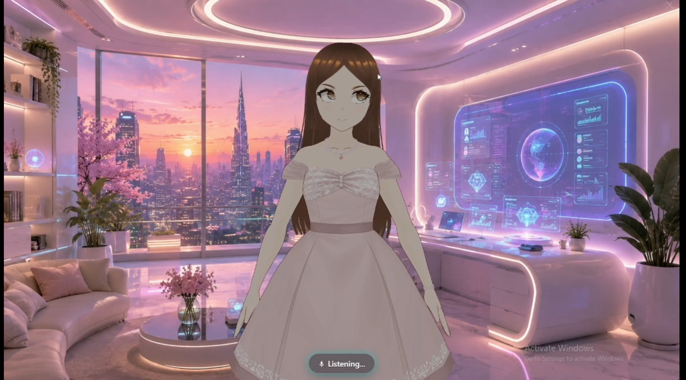
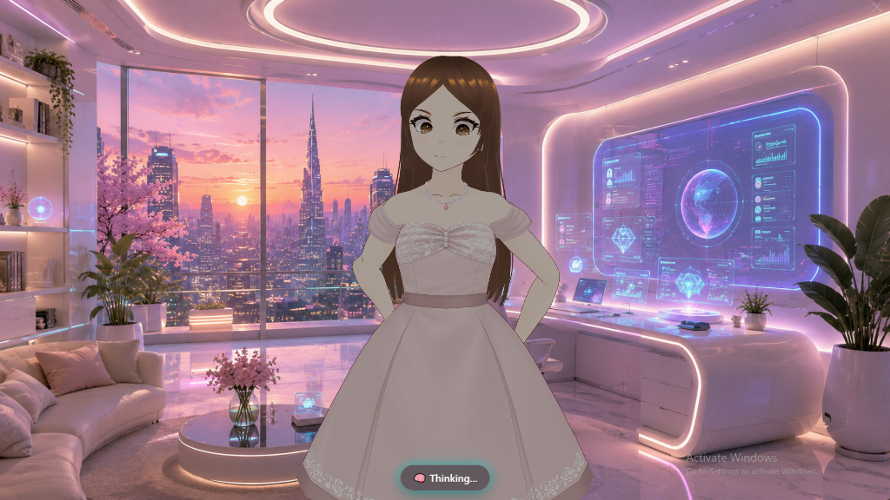
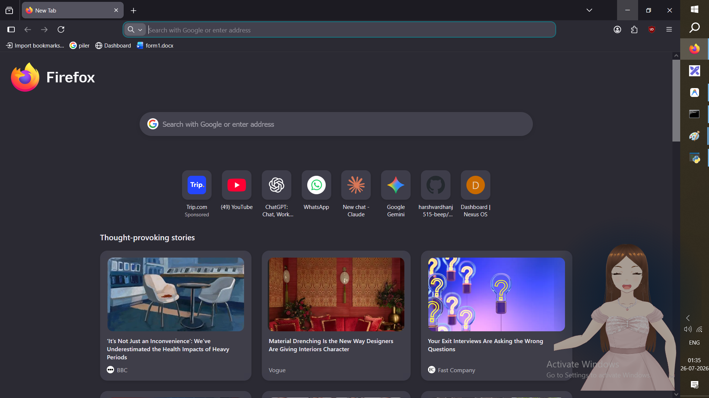
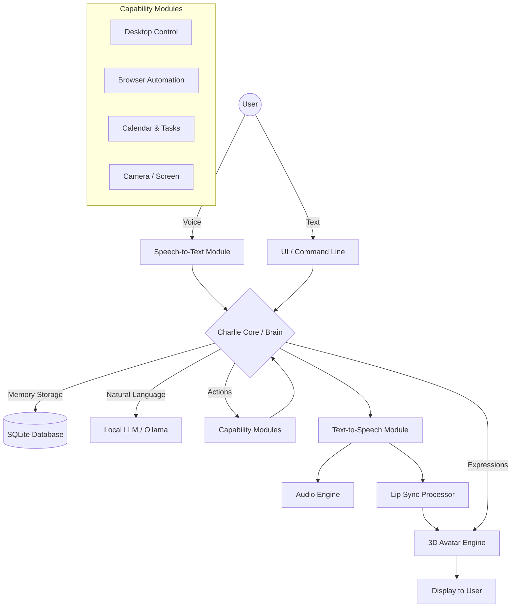

<div align="center">

# 🤖 Charlie AI Assistant



**An intelligent modular AI desktop assistant built with Python, featuring offline voice interaction, a real-time 3D VRM avatar, intelligent memory, and desktop automation.**

[](https://python.org)
[](https://microsoft.com)
[](LICENSE)
[](CONTRIBUTING.md)

[Watch the Demo Video](assets/demo/Charlie_Demo_1080p.mp4) • [Report Bug](https://github.com/harshvardhanj515-beep/charlie-ai-assistant/issues) • [Request Feature](https://github.com/harshvardhanj515-beep/charlie-ai-assistant/issues)

</div>

---

## 🚀 Overview

Charlie is a professional-grade modular AI desktop assistant designed to deliver an intelligent, voice-driven desktop experience completely offline. 

Unlike traditional cloud chatbots, Charlie interacts directly with your local environment, understands natural voice commands, automates repetitive tasks, manages productivity, and communicates through a highly expressive real-time 3D VRM avatar.

Built with a scalable, modular architecture, Charlie is designed to be easily extensible for developers wanting to build their own local AI ecosystem.

---

## ✨ Key Features

- **🎤 Offline Voice Interaction**: Lightning-fast local Wake Word Detection & Speech-to-Text via Whisper.
- **🔊 Natural Text-to-Speech**: High-quality offline voice synthesis.
- **👩 Real-Time 3D Avatar**: Fully integrated VRM 3D model with real-time lip sync and facial expressions.
- **🧠 Intelligent Local Memory**: Contextual long-term and short-term memory utilizing local LLMs.
- **💻 Desktop & Browser Automation**: Control local apps, execute macros, and manipulate web browsers autonomously.
- **📸 Vision Capabilities**: Screenshot analysis and webcam integrations.
- **📅 Productivity Suite**: Built-in Calendar, Task, and Contact management.
- **🔌 Highly Extensible**: Plug-and-play architecture for adding new capability modules.

---

## 📸 Showcase

<div align="center">
  
  
  <i>Voice Interaction & Speaking Animations</i>
</div>
<br>
<div align="center">
  
  
  <i>Desktop Automation & Media Control</i>
</div>
<br>
<div align="center">
  
  <br>
  <i>Floating Desktop Assistant Mode</i>
</div>

---

## 🏗️ System Architecture

Charlie is structured around a centralized modular brain that routes input and intent to specialized capability modules.



---

## 🛠️ Installation & Setup

### Prerequisites
- Python 3.11+
- Windows OS (Linux/macOS support planned)
- [Ollama](https://ollama.ai) installed locally (if using local inference)

### Quick Start

1. **Clone the repository**
   ```bash
   git clone https://github.com/harshvardhanj515-beep/charlie-ai-assistant.git
   cd charlie-ai-assistant
   ```

2. **Set up the virtual environment**
   ```bash
   python -m venv venv
   venv\Scripts\activate
   ```

3. **Install dependencies**
   ```bash
   pip install -r requirements.txt
   ```

4. **Run Charlie**
   ```bash
   python main.py
   ```

---

## 🗺️ Roadmap

- [x] Base Architecture & Local LLM Integration
- [x] VRM 3D Avatar Engine & Real-Time Lip Sync
- [x] Core Desktop Automation & Browser Control
- [ ] 🎵 Spotify / Media Player Integration
- [ ] 📧 Mail & Calendar Sync (Google Workspace)
- [ ] 🤖 RAG-based Long Term Document Memory
- [ ] ☁️ Cloud Sync Capabilities
- [ ] 📱 Mobile App Companion

---

## 🤝 Contributing

We welcome contributions from the open-source community! 

Please read our [Contributing Guidelines](CONTRIBUTING.md) to get started. Be sure to also review our [Code of Conduct](CODE_OF_CONDUCT.md).

---

## 👨‍💻 Author

**Harshvardhan Jadhav**  
*Python Developer | AI & Automation Enthusiast | Cybersecurity Learner*

Currently building intelligent software, AI assistants, and exploring modern system design.  
If you find this project helpful or inspiring, consider giving it a ⭐!

---

## 📄 License

This project is licensed under the MIT License - see the [LICENSE](LICENSE) file for details.
